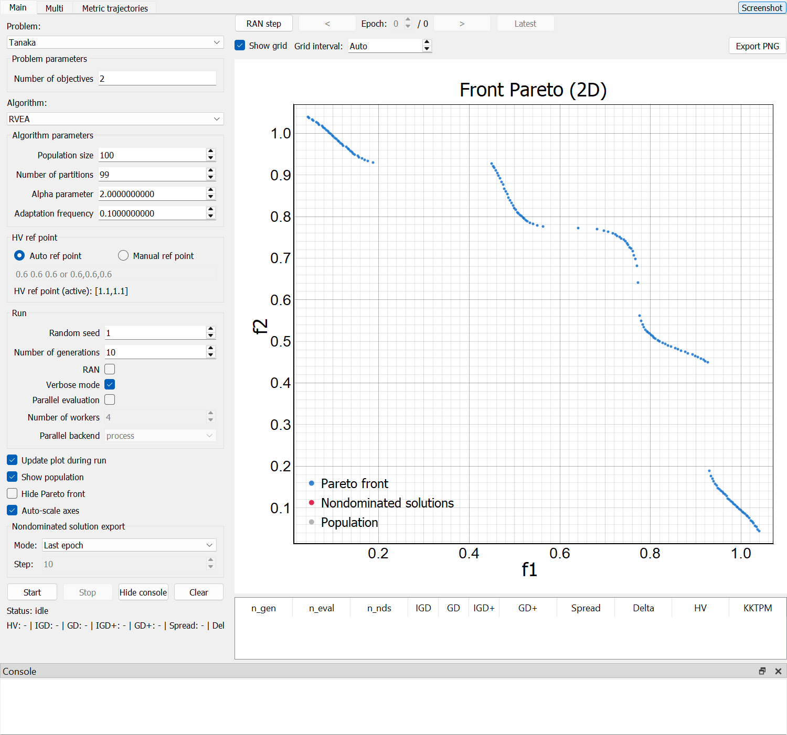

# AGtest-framework v0.1

[DOI: 10.5281/zenodo.22863482](https://doi.org/10.5281/zenodo.22872991)

Desktop framework for configuring, running, visualizing, and exporting
multi-objective optimization experiments based on `pymoo`.

## Download for Windows (no Python needed)

**[Open GitHub Releases to download the Windows EXE](https://github.com/KValevska/AGtest-framework/releases)**

1. Open a release and expand **Assets**.
2. Download **AGtest-framework.exe** and put it in the folder where you want to
   keep your experiments.
3. Double-click the EXE. Python and pip are not required on the destination
   Windows x64 computer.

Results are saved beside the EXE in `metrics_tables` and `solution_tables`.
The **Source code (zip)** and **Source code (tar.gz)** downloads contain the
source code, not the ready-to-run application. If no EXE release is listed yet,
use the [build instructions below](#standalone-windows-exe-no-python-needed).



The rest of this README covers installation from source, experiment workflows,
and extending the framework. Maintainers can follow the
[release publishing guide](docs/RELEASING.md) to upload a new EXE.

## Features

- registry-driven GUI forms for problems, algorithms, and run parameters
- responsive execution through a worker thread and generation-wise callbacks
- live Pareto-front visualization with options to hide the known Pareto front and show the current population
- generation-wise quality metrics with explicit hypervolume reference-point handling
- export of metric history and nondominated solutions to `.xlsx` workbooks
- optional parallel objective evaluation for expensive problems
- `RAN` mode for runs without a GUI-imposed generation limit
- `RAN step` button to compute one epoch per click, with previous/next and direct epoch selection
- switchable plot grid with an editable interval, larger axis text and nondominated points, and PNG export
- `Multi` tab for finite Cartesian experiments across multiple algorithms and problems without plot rendering
- `Metric trajectories` tab with one generation/value chart per metric for the current single experiment

## Requirements for running from source

Recommended environment:

- Python 3.10 or newer
- graphical desktop environment required by `PyQt5`
- runtime dependencies defined in `pyproject.toml`:
  - `numpy`
  - `matplotlib`
  - `PyQt5`
  - `pyqtgraph`
  - `pymoo`
  - `platypus-opt`

## Install

### Standalone Windows EXE (no Python needed)

Download `AGtest-framework.exe` from
[GitHub Releases](https://github.com/KValevska/AGtest-framework/releases), or use
`dist/AGtest-framework.exe` after a local build. Copy it to the destination Windows x64 computer and
double-click it. This single file includes Python, the runtime libraries, Qt,
and the local Pareto-front files. Python and pip are not needed on that computer.
The first launch may take a little longer while the executable unpacks its libraries.

Standalone results are saved **beside the EXE**, in the `metrics_tables` and
`solution_tables` folders, regardless of the working directory. The application
creates these folders automatically when saving results from Main or Multi runs.
The exported `.xlsx` files persist after the program closes. Source-checkout runs
continue to save results in the project folder. See
[Naming and output directories](#naming-and-output-directories) for an example.

To rebuild on Windows x64 with Python 3.11 installed:

```powershell
powershell -NoProfile -ExecutionPolicy Bypass -File .\build_exe.ps1
```

The script creates `.venv-build`, installs dependencies, runs the tests, builds
the EXE with PyInstaller, and tests a separate copy with Python removed from
`PATH`. The EXE self-test checks the GUI, problem factories, bundled reference
fronts, short algorithm runs, thread/process evaluation, and XLSX exports with
network access disabled. Its report and the build dependency versions are stored
in `build/`. A SHA-256 checksum is written to `dist/SHA256SUMS.txt` for publishing
with the EXE. Use `-SkipInstall` for an offline rebuild once dependencies are installed.
This check does not replace testing on a separate clean Windows computer.

The packaging configuration follows the PyInstaller documentation for
[single-file builds](https://pyinstaller.org/en/stable/spec-files.html) and
[multiprocessing support](https://pyinstaller.org/en/stable/common-issues-and-pitfalls.html#multi-processing).

### Install from source

Install runtime dependencies from the project metadata:

```powershell
pip install .
```

For development and testing, use:

```powershell
pip install -e .[dev]
```

Run tests:

```powershell
pytest
```

## Run

Run the GUI from a source checkout:

```powershell
python run_gui.py
```

Or, after installing the package:

```powershell
AGtest-framework
```

## Example workflow

1. Start the application with `python run_gui.py` or `AGtest-framework`.
2. Select a benchmark problem, for example `Kursawe`.
3. Select an optimization algorithm, for example `SPEA2`.
4. Configure the algorithm parameters and termination settings.
5. Set the hypervolume reference point if `HV` should be computed.
6. Start the run.
7. Inspect the Pareto-front visualization and generation-wise metric table.
8. Inspect metric trajectories for the current run.
9. Export the metric history and nondominated solutions to `.xlsx` files.

This workflow allows the user to run a complete multi-objective optimization
experiment without writing a separate execution script.

Above the Pareto plot, **RAN step** starts an unlimited run and pauses after epoch 1.
Click **Next epoch** to compute each subsequent epoch, or **Stop** to finish and save
the run. The arrow buttons and **Epoch** field browse already computed epochs;
**Latest** returns to the newest result. Epoch history is available for both normal
and stepped runs until the next run, problem change, or **Clear**.

Use **Show grid** to toggle grid lines and **Grid interval** to enter their spacing
in objective units (for example 1, 2, 3, or 0.5). A value of zero restores **Auto**.
**Export PNG** saves the currently displayed epoch, including the plot border,
axis labels and numbers, legend, and current axis ranges. It also preserves the
grid setting, visible layers, and the viewing angle of a 3D plot.

The small **Screenshot** button in the top-right corner saves the entire current
application window as PNG, including the active tab, settings, tables, and visible console.
The main window starts with square proportions and a compact bottom console. Spread,
Delta, and KKTPM trajectory axes display complete decimal values without SI scaling.

## Multi experiments

The `Multi` tab runs every selected algorithm against every selected problem.
It uses registry defaults for problem and algorithm parameters, applies the same
seed to every combination, and always requires a finite maximum generation
count. Multi experiments do not render Pareto plots.

Each combination is executed sequentially in a worker thread. A failure in one
combination is recorded in the results table and does not stop the remaining
runs. Metrics history and final nondominated solutions are saved as separate
`.xlsx` files in `metrics_tables` and `solution_tables`. Already completed and
partially completed results are preserved when the experiment is stopped.

## Metric trajectories

The `Metric trajectories` tab belongs only to single experiments started from
the `Main` tab. It displays a separate line chart for every supported metric,
with generation on the horizontal axis and metric value on the vertical axis.
If a metric has no finite value for the current run, its chart displays `N/A`
instead of an empty plot. Starting another Main experiment clears the previous
trajectories, while Multi experiments never modify them.

## Supported components

### Algorithms

- pymoo-based algorithms: `AGE-MOEA`, `Eps-MOEA`, `Eps-NSGA-II`, `GDE3`, `IBEA`, `LMOEA-DS`, `MOEAD`, `NSGA-II`, `NSGA-III`, `R-NSGA-III`, `RVEA`, `SPEA2`
- framework-specific research implementations: `Learning-across-problems EDMO`, `RNN-guided DMO`, `TS-NSGA`
- adapter-based integration: `MOEA/D (epsilon family)` via Platypus
- optional algorithm entry: `HypE`, when its import path is available at runtime

### Problem families

- local benchmark implementations: `Binh2`, `ConstrEx`, `FON`, `Golinski`, `Kursawe`, `Osyczka2`, `Schaffer`, `Srinivas`, `Tanaka`, `Viennet2`, `Viennet3`, `Water`
- pymoo-backed families: `ZDT1`-`ZDT6`, `DTLZ1`-`DTLZ7`
- local benchmark suites: `LZ09_F1`-`LZ09_F9`, `UF1`-`UF10`
- WFG suite: `WFG1`-`WFG9` in both `2D` and `3D` registry variants

### Quality indicators

- `HV`
- `GD`
- `IGD`
- `GD+`
- `IGD+`
- `Spread`
- `Delta`
- `KKTPM`

## Project layout

- `run_gui.py`: command-line bootstrap that adds `src` to `sys.path` and starts the GUI.
- `src/pymoo_gui/app.py`: main PyQt application window, dynamic forms, run orchestration, worker integration, plotting state, metrics table, and export triggers.
- `src/pymoo_gui/multi.py`: finite multi-algorithm/multi-problem experiment execution and result export.
- `src/pymoo_gui/algorithms`: algorithm implementations, adapters, shared callback code, and the algorithm registry.
- `src/pymoo_gui/problems`: local benchmark problem implementations, registry helpers, and known Pareto-front loaders.
- `src/pymoo_gui/metrics`: metric computation and XLSX export helpers.
- `src/pymoo_gui/viz`: Pareto-front visualization widgets and dialogs.
- `src/pymoo_gui/viz/metric_trajectories.py`: current Main-run metric history charts.
- `src/pymoo_gui/parallel.py`: optional parallel evaluation wrapper for expensive problem evaluations.
- `tests`: registry and runtime smoke tests.
- `docs/FUNCTION_CATALOG.md`: complete function, method, nested-function, and lambda inventory with source links.
- `docs/AGtest_framework_analysis_PL.pdf`: current Polish technical and functional analysis for v0.1.
- `docs/AGtest_framework_analysis_PL.html`: editable source used to regenerate that PDF.

## Architecture overview

The application has five main layers.

### 1. GUI layer

The GUI is implemented in `MainWindow` and is responsible for:

- showing problem and algorithm selectors
- building parameter forms dynamically
- validating run settings
- handling start and stop actions
- showing the Pareto visualization
- showing the generation-wise metric table
- triggering result export

The GUI does not hard-code separate forms for each algorithm or problem. It
builds them from registry metadata and callable signatures.

### 2. Registry layer

Problems and algorithms are exposed through two dictionaries:

- `PROBLEMS`
- `ALGORITHMS`

Each entry contains at least:

- `label`: text shown in the GUI
- `factory`: callable used to create the runtime object

Optional metadata includes:

- `form_fields`: explicit field definitions for the dynamic form
- `form_note`: descriptive note used by the GUI
- `known_pf_factory`: function returning a known Pareto front for preview and metrics

Because the GUI depends on these registries instead of directly importing one
algorithm or one problem, extending the framework usually means adding one new
module and one new registry entry.

### 3. Runtime execution layer

The optimization run is executed in `OptimizationWorker`, which subclasses
`QThread`. This keeps the GUI responsive while the optimization is running.

The worker:

- creates the selected problem from `PROBLEMS`
- optionally wraps the problem for parallel evaluation
- creates the selected algorithm from `ALGORITHMS`
- creates a generation callback
- runs the optimization
- emits generation payloads back to the GUI
- emits final success, cancellation, or failure signals

### 4. Monitoring and metrics layer

A shared callback collects generation-level state from the optimizer. It reads:

- current generation number
- number of evaluations
- current population in decision space
- current population in objective space
- constraint-violation data

It then:

- filters feasible solutions
- extracts the feasible nondominated set
- computes supported quality indicators
- assembles a normalized payload for the GUI

This callback is shared across algorithms, which avoids duplicating monitoring
logic in every implementation.

### 5. Export layer

The framework exports results as `.xlsx` files. It writes:

- a metrics workbook containing the generation history table
- a solutions workbook containing nondominated solutions, either for the final epoch or for selected epochs

The export code builds minimal Excel-compatible XML files and packages them into
an `.xlsx` archive. It does not depend on pandas or openpyxl.

## How the GUI uses registry metadata

When the user selects a problem or algorithm:

1. The GUI reads the registry entry.
2. It inspects the `factory` signature.
3. It merges the signature with explicit `form_fields`.
4. It builds a `ParamForm` dynamically.
5. It reads the widget values back into Python objects before starting a run.

This means the registry is not just a list of available options. It also drives
the form-generation logic.

## Exact structure of a registry entry

### Algorithm entry

Typical structure:

```python
MY_ALGORITHM_DEFINITION = {
    "label": "My Algorithm",
    "factory": make_my_algorithm,
    "form_fields": {
        "pop_size": {"default": 100, "kind": "int", "minimum": 1},
        "alpha": {"default": 0.5, "kind": "float", "minimum": 0.0},
    },
    "form_note": "Short description shown in the GUI.",
}
```

### Problem entry

Typical structure:

```python
PROBLEMS["my_problem"] = {
    "label": "My Problem",
    "factory": make_my_problem,
    "form_fields": {
        "n_var": {"default": 10, "kind": "int", "minimum": 1},
        "n_obj": {"default": 2, "kind": "int", "read_only": True},
    },
    "form_note": "Problem description shown in the GUI.",
    "known_pf_factory": my_known_pf_loader,
}
```

## How to add a new algorithm

There are three supported patterns. Choose the simplest one that matches your
algorithm.

### Pattern A. Native pymoo algorithm

Use this when your algorithm can be represented directly as a standard pymoo
algorithm object.

Examples in the repository follow this pattern for simple baselines such as
NSGA-II.

Steps:

1. Create a new module in `src/pymoo_gui/algorithms`, for example `my_algo.py`.
2. Add a factory function, for example:

```python
from typing import Any, Dict
from pymoo.algorithms.moo.nsga2 import NSGA2


def make_my_algo(pop_size: int = 100) -> NSGA2:
    return NSGA2(pop_size=int(pop_size))


MY_ALGO_DEFINITION: Dict[str, Any] = {
    "label": "My Algo",
    "factory": make_my_algo,
    "form_fields": {
        "pop_size": {"default": 100, "kind": "int", "minimum": 1},
    },
    "form_note": "Short GUI description.",
}
```

3. Import `MY_ALGO_DEFINITION` in `src/pymoo_gui/algorithms/__init__.py`.
4. Add it to the `ALGORITHMS` dictionary.
5. Run `pytest`.

Notes:

- The GUI will automatically create form fields from the factory signature and
  `form_fields`.
- The worker will pass `seed`, `verbose`, `termination`, and `callback` when the
  run starts. Your factory does not have to accept these because they are passed
  to `minimize`, not to the factory itself.

### Pattern B. Custom research algorithm built inside this framework

Use this when you are implementing your own evolutionary loop and want to reuse
the framework's shared runtime helpers.

The recommended starting point is:

- `src/pymoo_gui/algorithms/empty_algorithm_template.py`
- `src/pymoo_gui/algorithms/research_common.py`

Steps:

1. Copy `empty_algorithm_template.py` to a new file.
2. Rename the class, factory, and registry constant.
3. Implement or override the relevant hooks:
   - `after_initialize`
   - `guided_candidates`
   - `create_offspring`
   - `environmental_selection`
   - `after_generation`
4. Keep the factory focused on configuration only.
5. Define the registry entry.
6. Import it in `algorithms/__init__.py` and add it to `ALGORITHMS`.
7. Run tests and at least one short GUI run.

This pattern is useful because the shared base already provides:

- bounds handling
- problem evaluation
- nondominated sorting
- feasibility-first logic
- deterministic loop structure compatible with the GUI callback model

### Pattern C. Adapter around a non-pymoo runtime

Use this when the underlying algorithm comes from another library or uses a
different iteration API.

In this case, your runtime object should expose a `gui_minimize(...)` method.
The framework checks for this method first. If it exists, it is used instead of
standard `pymoo.optimize.minimize`.

This is how the repository integrates Platypus-based algorithms.

Requirements for `gui_minimize(...)`:

- accept `problem`
- accept `termination`
- accept optional `seed`
- accept optional `callback`
- update enough state for the callback to read:
  - `n_gen`
  - `evaluator.n_eval`
  - `pop.get("X")`
  - `pop.get("F")`
  - `pop.get("CV")`

If those fields are missing, the shared callback cannot construct the monitoring
payload correctly.

## Algorithm checklist

Before registering a new algorithm, check all of the following:

- the factory is callable
- the registry entry has a `label`
- the factory signature matches the parameters you want in the GUI
- `form_fields` use correct `kind` values such as `int`, `float`, `bool`, or `choice`
- the algorithm can run with the selected problem
- the callback can read generation state
- short runs complete without exceptions

## How to add a new problem

There are two supported patterns.

Start from `src/pymoo_gui/problems/empty_benchmark_template.py` when implementing
a benchmark locally. The template includes vectorized objective evaluation,
dimension and bound validation, commented constraint extension points, a
Pareto-front hook, a factory, and optional GUI registry metadata. Copy or rename
the file, replace the placeholder equations, and register the completed
definition only after a short standalone evaluation succeeds.

### Pattern A. Local problem class

Use this when you want the problem to live inside the repository.

Steps:

1. Create a new file in `src/pymoo_gui/problems`, for example `my_problem.py`.
2. Implement a class derived from `pymoo.core.problem.Problem`.
3. In `__init__`, define:
   - `n_var`
   - `n_obj`
   - constraint counts if needed
   - lower and upper bounds
4. Implement `_evaluate(self, X, out, *args, **kwargs)`.
5. Write objective values to `out["F"]`.
6. If the problem has inequality constraints, write them to `out["G"]`.
7. If the problem has equality constraints, expose them consistently with the
   rest of the framework if needed by your algorithm path.
8. Add a factory function if you want argument conversion or defaults.
9. Register the problem in `PROBLEMS`.
10. If you want the class publicly re-exported, add it to `problems/__init__.py`.

Minimal example:

```python
import numpy as np
from pymoo.core.problem import Problem


class MyProblem(Problem):
    def __init__(self, n_var: int = 10):
        super().__init__(n_var=int(n_var), n_obj=2, n_constr=0, xl=-1.0, xu=1.0)

    def _evaluate(self, X, out, *args, **kwargs):
        f1 = np.sum(X ** 2, axis=1)
        f2 = np.sum((X - 1.0) ** 2, axis=1)
        out["F"] = np.column_stack([f1, f2])
```

### Pattern B. Wrapper around an existing pymoo problem

Use this when pymoo already provides the problem.

In that case, the registry entry can use a lambda or factory around
`pymoo.problems.get_problem(...)`.

This is how many ZDT, DTLZ, and WFG entries are added.

## Problem checklist

Before registering a new problem, check all of the following:

- the factory is callable
- the registry entry has a `label`
- `n_var` and `n_obj` are correct
- bounds are defined if the algorithm expects them
- `_evaluate` handles batched input `X`
- `out["F"]` has shape `(n_points, n_obj)`
- constraint outputs are consistent
- the problem works in a short standalone evaluation

## How to register a new problem

If the problem is local and has a known Pareto-front file:

1. Put the `.pf` file in `src/pymoo_gui/problems`.
2. Register the problem with `known_pf_factory=_pf_file_loader("MyProblem.pf", expected_n_obj=2)`.

If the problem has no known Pareto front:

- omit `known_pf_factory`
- the GUI will still run the optimization, but some metrics may remain unavailable

Recommended fields:

- `n_var`: editable integer if the number of variables is configurable
- `n_obj`: editable integer only if the problem really supports changing it
- `n_obj` as `read_only=True` when it is fixed and only informational

## How the worker thread works

The worker thread is the runtime bridge between GUI configuration and actual
optimization.

Sequence:

1. The GUI validates user input.
2. The GUI prepares export paths and run state.
3. The GUI creates `OptimizationWorker`.
4. The worker creates the problem instance from the problem registry.
5. The worker loads the known Pareto front if a loader is available.
6. The worker optionally wraps the problem in `ParallelProblem`.
7. The worker creates the algorithm instance from the algorithm registry.
8. The worker creates the shared generation callback.
9. The worker launches the optimization.
10. The callback emits generation payloads to the GUI.
11. The worker emits one of:
    - `done`
    - `cancelled`
    - `failed`

Cancellation is cooperative. The worker stores a cancellation flag and checks it
between payload emissions. This means cancellation is safe, but it usually takes
effect after the current generation finishes.

## How metrics are computed

The framework computes metrics from the feasible nondominated approximation set
available in each generation.

The shared callback:

- reads `X`, `F`, and `CV` from the current population
- normalizes objective data
- filters invalid rows
- builds a feasibility mask from constraint violation
- computes the feasible nondominated subset
- maps nondominated objective rows back to their decision vectors
- computes supported indicators
- emits a normalized payload

Supported metrics include:

- `HV`
- `GD`
- `IGD`
- `GD+`
- `IGD+`
- `Spread`
- `Delta`
- `KKTPM`

Important behavior:

- `HV` requires a valid reference point
- `GD`, `IGD`, `GD+`, and `IGD+` require a known Pareto front
- `Delta` is computed for every algorithm in single and batch runs and its generation chart is always visible. It uses classical Delta for two objectives and [generalized spread](https://jmetal.sourceforge.net/javadoc/jmetal/qualityIndicator/GeneralizedSpread.html) for more objectives, with Euclidean distances in the original objective coordinates. A matching reference Pareto front and at least two finite feasible nondominated solutions are required; otherwise the value is `N/A`.
- `KKTPM` requires decision vectors and a compatible problem definition; finite variable bounds are included as KKT inequality constraints
- the generation-level `KKTPM` value is the arithmetic mean over finite values for the current feasible nondominated set

## How metrics and solutions are exported

### Metrics export

The GUI stores generation payloads in a table. At the end of the run, the table
is exported to an `.xlsx` workbook.

The exported table contains:

- generation number
- evaluation count
- nondominated count
- metric values in the GUI table order

### Nondominated solution export

The GUI can export nondominated solutions:

- only for the final epoch
- every `N` epochs
- in cascade mode

Each exported row may contain:

- `id`
- `f1`, `f2`, ...
- `x1`, `x2`, ... when decision vectors are available

If multiple epochs are exported, the solutions workbook contains multiple
worksheets named by epoch.

## Result formats produced by the framework

The framework produces both in-memory and on-disk results.

### In-memory runtime data

- generation payloads
- current plot state
- metrics table contents
- final payload kept by the worker

### Exported files

- metrics workbook: `.xlsx`
- nondominated solutions workbook: `.xlsx`

### Known Pareto-front inputs

The framework can also consume reference fronts from:

- local `.pf` text files stored next to problem modules
- problem methods such as `pareto_front(...)` when available

## Naming and output directories

Metrics workbooks are written to:

- `metrics_tables`

Solution workbooks are written to:

- `solution_tables`

The filename includes sanitized algorithm and problem names. If a file already
exists, the exporter appends `_1`, `_2`, and so on.

When running **AGtest-framework.exe**, both output folders are created
automatically **in the folder containing the EXE** when results are saved. This
applies to both Main and Multi experiments, including launches through a shortcut
or from another working directory.

For example, if the executable is `D:\Experiments\AGtest-framework.exe`, the
directory layout after exporting results is:

```text
D:\Experiments\
    AGtest-framework.exe
    metrics_tables\
        ... .xlsx
    solution_tables\
        ... .xlsx
```

`metrics_tables` contains metric histories, and `solution_tables` contains
nondominated solutions. Results remain available after the application closes.
Moving the EXE changes where future results are saved; existing result folders
are not moved automatically.

When running from a source checkout with `python run_gui.py`, these folders are
created in the project root.

## Parallel evaluation support

The run form can enable parallel evaluation of the problem.

Behavior:

- `thread` backend uses a `ThreadPool`
- `process` backend uses `multiprocessing` with the `spawn` start method
- the original problem is wrapped in `ParallelProblem`
- rows of `X` are evaluated independently and then reassembled into pymoo-style
  arrays

Use this only when objective evaluation is expensive enough to compensate for
parallel overhead.

## Recommended validation after adding a new algorithm or problem

After any extension, do all of the following:

1. Run `pytest`.
2. Start the GUI.
3. Select the new problem or algorithm.
4. Check that the form renders correctly.
5. Run a short optimization, for example `n_gen=2`.
6. Confirm that:
   - the run starts
   - the plot updates
   - the metrics table gets rows
   - export files are created
   - no callback diagnostics indicate broken state

## Notes

- The canonical package name is `algorithms`; the old `algoritms` alias is kept for backward compatibility.
- Runtime export directories are intentionally ignored by Git.
- Registry integrity is covered by tests, so missing labels or factories should be caught early.

## Known limitations

- Some quality indicators require a known Pareto front or reference approximation set.
- Hypervolume computation requires a valid reference point.
- `KKTPM` requires decision vectors and a compatible problem definition.
- Exported solution workbooks contain nondominated solutions, not necessarily the full population.
- Parallel evaluation is useful only when objective-function evaluation is sufficiently expensive to compensate for parallelization overhead.

## License

AGtest-framework is licensed under the Apache License 2.0. See [LICENSE](LICENSE)
for the complete license terms.

## Citation

If you use this software in academic work, cite the repository release used
for your experiments. Citation metadata are provided in [CITATION.cff](CITATION.cff).
The project is archived on Zenodo:
[DOI: 10.5281/zenodo.22863482](https://doi.org/10.5281/zenodo.22863482).

```bibtex
@software{agtest_framework,
  title = {AGtest-framework},
  author = {Valevska, Kristina and Rudziński, Filip},
  year = {2026},
  version = {0.1},
  doi = {10.5281/zenodo.22863482},
  url = {https://github.com/KValevska/AGtest-framework}
}
```
